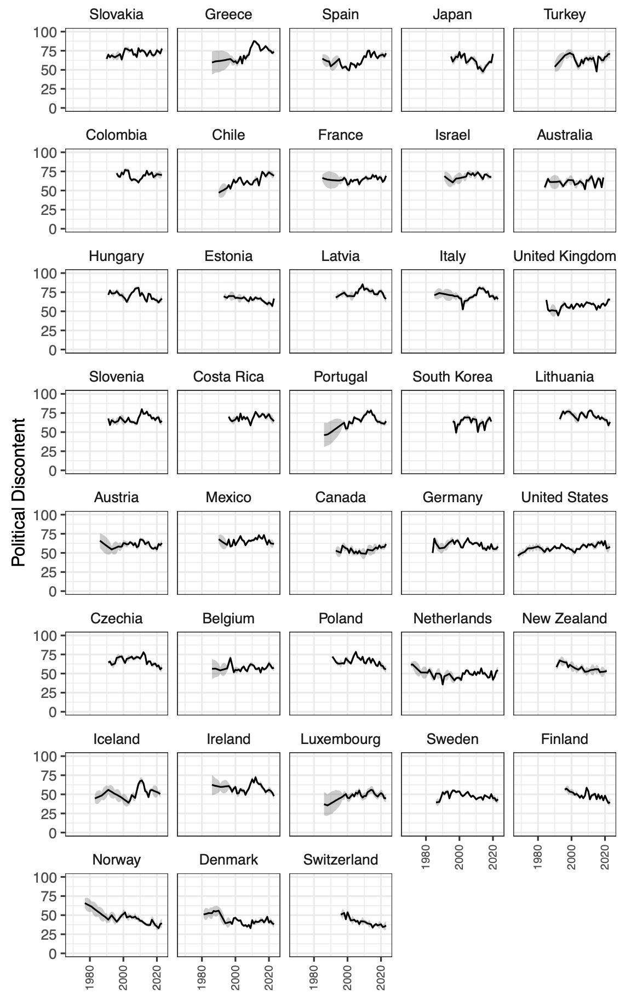
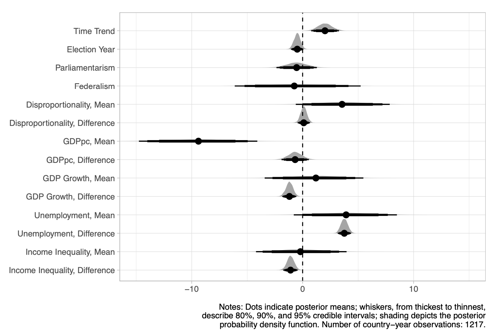

:::{#cite}
:::


## Abstract

Public discontent with the political system has become an increasingly salient concern in recent years, with the argument that it undermines democratic stability and effective governance. Nevertheless, the understanding of the nature, trends, and drivers of political discontent remain debated, largely reflecting the constraints from available survey data and items in the construction of measurement. This article takes advantage of state-of-the-art latent-variable modeling to aggregate survey responses and a comprehensive collection of survey data to generate dynamic comparative estimates of public political discontent (PPD) for 136 countries and regions over 56 years (1968–2023). These PPD scores are validated with responses to the individual source-data survey items that were used to generate them as well as the democratic evaluation survey item that was not used in our estimation. Next, a cross-national and longitudinal analysis of PPD in advanced democracies (i.e., OECD countries) highlights that PPD has been on a rising trend, rather than merely trendless fluctuations. Our results reveal that these increased discontents are largely attributable to worsening economic conditions, including low average income, slow growth, and high unemployment rates.

## Important figures





## BibTeX citation

```bibtex
@misc{MaChoiTaiHuSolt2026,
 title={Macrodiscontent Across Countries},
 DOI={doi.org/10.1017/S1755773926100599},
 publisher={European Political Science Review},
 author={Ma, Haofeng and Choi, Jeongho and Tai, Yuehong Cassandra and Hu, Yue and Solt, Frederick},
 year={2026},
 month={Aug},
 volume={},
 number={},
 pages={1--17}
}
```
