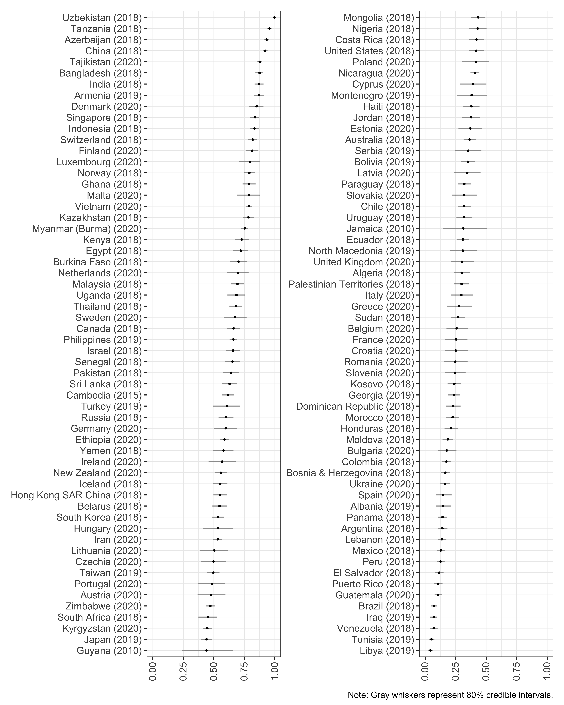
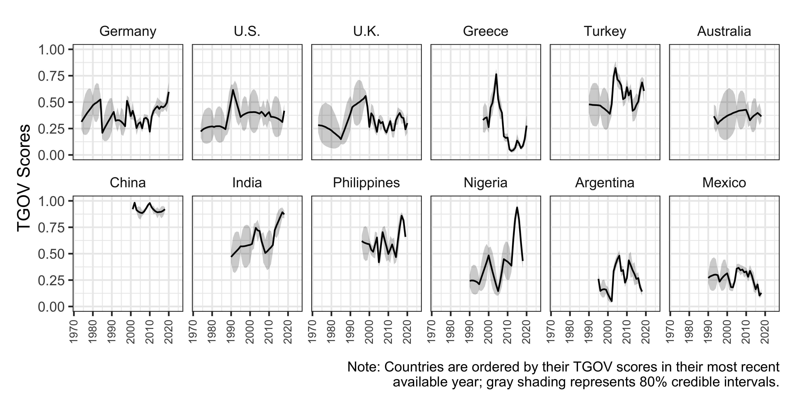
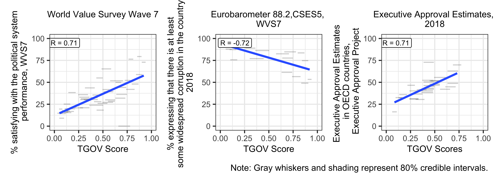

:::{#cite}
:::


## Abstract
Although political trust is a long-standing interdisciplinary topic, the lack of com parable cross-national time-series data has limited scholars’ ability to analyze its determinants and consequences and to generalize findings across countries and over time. To address this gap, this paper introduces the Trust in National Government (TrustGov) Dataset—a cross-national time-series resource covering 115 countries and territories from 1973 to 2020, harmonizing 1,545 country-year observations from 189 national and cross-national surveys using a Bayesian latent variable model. The dataset is validated through a series of convergent and construct validity tests. TrustGov supports qualitative and mixed-method research by guiding case selection and helping scholars probe mechanisms behind shifts in trust. It also enables quantitative analyses of trust’s dynamic relationships with determinants such as inequality, election integrity, and institutional performance, as well as outcomes such as policy preferences and crisis resilience. The project will be updated regularly through periodic releases as new data become publicly available, supporting ongoing research on political trust.

## Important figures








## BibTeX citation

```bibtex
@misc{Tai2026,
 author={Tai, Yuehong Cassandra},
 title={Comparative Estimates of Public Trust in Government Across 116 Countries, 1973–2020},
 publisher={Research & Politics},
 volume = {13},
 number = {1},
 pages = {},
 year={2026},
 doi = {10.1177/20531680261432469},
 url = {https://doi.org/10.1177/20531680261432469}
}
```
